<div align="center">

<!-- ══════════════════════════════════════════════════════ -->
<!--                     HEADER BANNER                      -->
<!-- ══════════════════════════════════════════════════════ -->


<br/>

<!-- Typing SVG — Fira Code, exact brand orange -->
<a href="https://git.io/typing-svg">
  
</a>

<br/><br/>

<!-- Profile view counter -->


<br/><br/>

<!-- ─── Minimal Identity Badges ─── -->
<a href="https://www.linkedin.com/in/ajay-raut">
  
</a>
&nbsp;

&nbsp;

&nbsp;
<a href="mailto:ajayraut2500@gmail.com">
  
</a>

</div>

<br/>

---

## `$ whoami`

```text
Software Developer & Cloud/DevOps Enthusiast from Pune, India.
Building scalable backends, orchestrating containers, and
automating cloud infrastructure — bridging dev and ops
to ship reliable, high-performance systems.
```

> 🔭 **Working on:** [Scalable-GO-API](https://github.com/AjayRaut/Scalable-GO-API.git) &nbsp;|&nbsp;
> 🤝 **Collaborating:** AI-Trip-Builder &nbsp;|&nbsp;
> 🌱 **Learning:** FastAPI · Kubernetes · Golang

---

## ⚡ Tech Stack

<div align="center">

**`💻 Languages`**

<a href="https://skillicons.dev">
  
</a>

<br/><br/>

**`⚡ Frameworks & Libraries`**

<a href="https://skillicons.dev">
  
</a>

<br/><br/>

**`☁️ Cloud & DevOps`**

<a href="https://skillicons.dev">
  
</a>

<br/><br/>

**`💾 Databases & Tools`**

<a href="https://skillicons.dev">
  
</a>

</div>

---

## 📊 GitHub Metrics

<div align="center">

<!-- ── Tier 1: Trophy Cabinet (github-profile-trophy, no Vercel) ── -->
<a href="https://github.com/AjayRaut">
  
</a>

<br/><br/>

<!-- ── Tier 2: Stats + Languages — GitHub Actions generated SVGs ── -->
<a href="https://github.com/AjayRaut">
  
</a>
&nbsp;
<a href="https://github.com/AjayRaut">
  
</a>

<br/><br/>

<!-- ── Tier 3: Streak — GitHub Actions generated SVG ── -->
<a href="https://github.com/AjayRaut">
  
</a>

</div>

---

## 🐍 Contribution Timeline

<div align="center">

```
  Watch commits snake their way across the grid ↓
```


</div>

---

## 💬 What I'm Into

| 🔧 Engineering | ☁️ Infrastructure | ⚛️ Frontend |
|:---|:---|:---|
| Python · Go · FastAPI backends | AWS · Docker · Kubernetes | React · Next.js · Tailwind |
| REST APIs · TDD · Layered arch | CI/CD · GitHub Actions · Jenkins | Component design · State mgmt |
| Wazuh SIEM · Security ops | GitLab · OpenSearch · Linux | TypeScript · Responsive UI |

---

## 🤝 Connect

<div align="center">

<a href="https://www.linkedin.com/in/ajay-raut">
  
</a>
&nbsp;
<a href="mailto:ajayraut2500@gmail.com">
  
</a>
&nbsp;
<a href="https://github.com/AjayRaut">
  
</a>

<br/><br/>

<sub>Built with 🔶 and Fira Code · Pune, India</sub>

</div>
