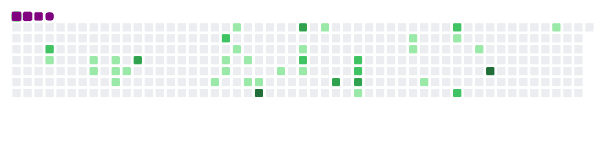

<div align="center">

<!-- ══════════════════════════════════════════════════════ -->
<!--                     HEADER BANNER                      -->
<!-- ══════════════════════════════════════════════════════ -->


<br/>

<!-- Typing SVG — Fira Code, exact brand orange -->
<a href="https://git.io/typing-svg">
  
</a>

<br/><br/>

<!-- Profile view counter -->


<br/><br/>

<!-- ─── Minimal Identity Badges ─── -->
<a href="https://www.linkedin.com/in/ajay-raut">
  
</a>
&nbsp;

&nbsp;

&nbsp;
<a href="mailto:ajayraut2500@gmail.com">
  
</a>

</div>

<br/>

---
## 🐍 Contribution Timeline

<div align="center">

<!-- snake.yml commits animated GIFs directly to main branch -->
<picture>
  <source
    media="(prefers-color-scheme: dark)"
    srcset="github-contribution-grid-snake-dark.gif"
  />
  <source
    media="(prefers-color-scheme: light)"
    srcset="github-contribution-grid-snake.gif"
  />
  
</picture>

</div>

---

## `$ whoami`

```text
Software Developer & Cloud/DevOps Enthusiast from Pune, India.
Building scalable backends, orchestrating containers, and
automating cloud infrastructure — bridging dev and ops
to ship reliable, high-performance systems.
```

> 🔭 **Working on:** [Scalable-GO-API](https://github.com/AjayRaut/Scalable-GO-API.git) &nbsp;|&nbsp;
> 🤝 **Collaborating:** AI-Trip-Builder &nbsp;|&nbsp;
> 🌱 **Learning:** FastAPI · Kubernetes · Golang

---

## ⚡ Tech Stack

<div align="center">

**`💻 Languages`**

<a href="https://skillicons.dev">
  
</a>

<br/><br/>

**`⚡ Frameworks & Libraries`**

<a href="https://skillicons.dev">
  
</a>

<br/><br/>

**`☁️ Cloud & DevOps`**

<a href="https://skillicons.dev">
  
</a>

<br/><br/>

**`💾 Databases & Tools`**

<a href="https://skillicons.dev">
  
</a>

</div>


---

## 📊 GitHub Metrics

<div align="center">
  
  
</div>
<br/>
<div align="center">
  
</div>

<div align="center">
  
</div>

---

## 💬 What I'm Into

<div align="center">
<table width="100%" style="margin-left: auto; margin-right: auto;">
  <tr>
    <td width="33.3%" valign="top" align="left">
      <h3>🔧 Engineering</h3>
      <ul>
        <li>Python · Go · FastAPI backends</li>
        <li>REST APIs · TDD · Layered arch</li>
        <li>Wazuh SIEM · Security ops</li>
      </ul>
    </td>
    <td width="33.3%" valign="top" align="left">
      <h3>☁️ Infrastructure</h3>
      <ul>
        <li>AWS · Docker · Kubernetes</li>
        <li>CI/CD · GitHub Actions · Jenkins</li>
        <li>GitLab · OpenSearch · Linux</li>
      </ul>
    </td>
    <td width="33.3%" valign="top" align="left">
      <h3>⚛️ Frontend</h3>
      <ul>
        <li>React · Next.js · Tailwind</li>
        <li>Component design · State mgmt</li>
        <li>TypeScript · Responsive UI</li>
      </ul>
    </td>
  </tr>
</table>
</div>
---

## 🤝 Connect

<div align="center">

<a href="https://www.linkedin.com/in/ajay-raut" target="_blank">
  
</a>
&nbsp;
<a href="mailto:ajayraut2500@gmail.com">
  
</a>
&nbsp;
<a href="https://github.com/ajay-raut" target="_blank">
  
</a>

<br/><br/>

</div>
